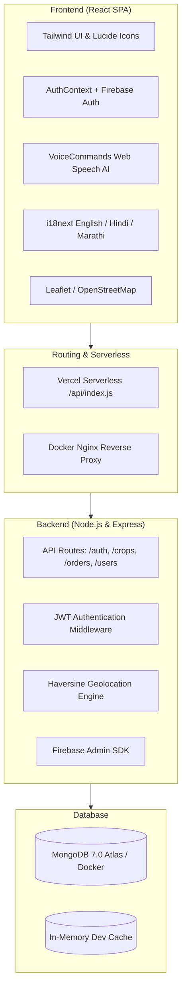

# Farm2Market System Architecture

## Overview
Farm2Market is a full-stack digital marketplace connecting farmers directly with agricultural produce buyers (retailers, restaurants, bulk consumers) across India.

## Directory Structure
- `client/`: React 18 frontend with Tailwind CSS, React Query, react-i18next, and Lucide React.
- `server/`: Express REST API with Mongoose/MongoDB, bcryptjs, jsonwebtoken, and Firebase Admin.
- `api/`: Vercel serverless function entrypoint for serverless deployment.
- `nginx/`: Docker reverse proxy configuration and SSL certificate paths.
- `scripts/`: Production build automation scripts.
- `tests/`: Automated regression test suite and manual testing fixtures.
- `docs/`: Architectural specifications, API guides, and roadmap.
