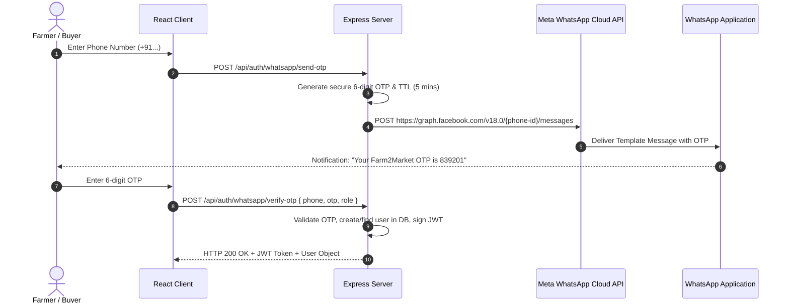

# WhatsApp Integration & Cloud API Architecture Guide

This document explains the WhatsApp capabilities in Farm2Market and provides the implementation blueprint for production Meta WhatsApp Cloud API / OTP integration.

---

## 1. Current Working Capabilities
Farm2Market currently includes direct WhatsApp integration via structured deep-links:
- **Crop Detail Inquiries**: Opens WhatsApp with pre-filled crop name, quantity, unit price, and listing link.
- **Listing Sharing**: Enables one-click viral sharing of produce cards to WhatsApp groups and contacts.
- **Support Helpline**: 24/7 direct helpline access via navbar, contact page, and footer.

---

## 2. Production WhatsApp OTP Authentication Blueprint

For production deployments requiring true OTP verification via WhatsApp:

### Architecture Flow


### Environment Variables Required
```env
WHATSAPP_CLOUD_API_URL=https://graph.facebook.com/v18.0
WHATSAPP_PHONE_NUMBER_ID=your_phone_number_id
WHATSAPP_BUSINESS_ACCOUNT_ID=your_waba_id
WHATSAPP_ACCESS_TOKEN=EAAB...your_permanent_system_token
WHATSAPP_TEMPLATE_NAME=farm2market_login_otp
```
